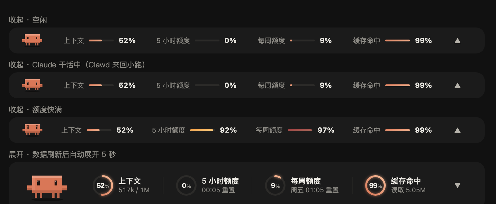

# claude-desktop-mods

为 **Claude 桌面 App 的 Code 页** 做的 mod（Claude Code 插件）。
Mods for the **Code tab of the Claude Desktop app**.

> **非官方项目**：与 Anthropic 无关，也未获其认可。Clawd 是 Anthropic 的吉祥物，这里是粉丝自制的像素版。
> **Unofficial.** Not affiliated with or endorsed by Anthropic. Clawd is Anthropic's mascot; the pixel version here is fan-made.

| Mod | 简介 / What it does |
| --- | --- |
| [`usage-pet`](plugins/usage-pet) | 输入框上方的用量信息栏 + Clawd 像素桌宠 · A usage band above the prompt with Clawd, an animated pixel pet |



🎬 宣传片 / Promo video（English · 中文）: [x.com/Superboy4949](https://x.com/Superboy4949/status/2106760680837890311)

---

## 中文

### usage-pet：Clawd 信息栏

- **四项用量**：上下文、5 小时额度、每周额度、缓存命中率（本会话累计）。80% 变琥珀色，95% 变红；缓存命中低于 50% 才提醒
- **自动折叠**：平时是一条 30px 的细条；每次 Claude 回答完、数据刷新时自动展开 5 秒，播完动画再收起
- **展开时**：圆环依次扫入、数字像老虎机一样滚动、旁边飘出「+N%」
- **Clawd**：空闲时呼吸、眨眼、张望；Claude 干活时搬出笔记本敲代码（收起时在细条上来回小跑）；额度 ≥90% 冒汗发抖；缓存命中 ≥90% 戴上墨镜放松（点子来自 [@Joshua_WD](https://x.com/Joshua_WD)）
- **中英双语**：默认跟随系统语言；`/config` 里的 `language` 可以选 `auto` / `zh` / `en`
- **浅色 / 深色**：跟着 Claude App 的外观设置自动切换，背景始终透明
- **养成**：Claude 每答完一轮 Clawd 涨 10 点经验（缓存命中 ≥90% 再 +5，每天第一轮 +20）。Lv.2 头顶冒出小芽、Lv.3 戴红领结、Lv.5 换棒球帽、Lv.10 戴皇冠；还有 8 个成就（缓存大师、夜猫子、极限操作、连续 7 天……）。鼠标放到 Clawd 身上看等级和经验，数据跨会话保存
- **战报卡**：输入 `/clawd-card`，生成本次会话的战报（时长、回合、工具调用、改动文件、Tokens、缓存命中、等级、本次解锁的成就），复制到剪贴板、存到「图片/Clawd Reports」（只留最近 20 张，更早的自动移进废纸篓），直接粘贴到 X（导出图片需要 macOS）
- **鼠标**：放到 Clawd 身上会冒爱心，点它会空翻；放到圆环上显示详细数值
- **切换**：点右侧 ▲ 一直展开，点 ▼ 收起；或在输入框输入 `/clawd`
- **更新提示**：插件更新后第一次打开，右上角会弹出这次改了什么（停 1 分钟，鼠标放上去会停住，点一下就关；看过就不再弹）。升级、解锁成就也是这样提示

### 安装

在终端运行：

```bash
claude plugin marketplace add manson341349-beep/claude-desktop-mods
claude plugin install usage-pet@claude-desktop-mods
```

然后在 Claude App 的会话里输入 `/reload-plugins`，或者新开一个会话。

### 更新

第三方插件市场**默认不自动更新**。想自动收到新版本：在会话里打开 `/plugin` → **Marketplaces** → 选 `claude-desktop-mods` → **Enable auto-update**。之后有新版本时会提示 `Plugin updated: usage-pet · Run /reload-plugins to apply`，重载后插件会弹出这次的更新内容。

手动更新：

```bash
claude plugin update usage-pet@claude-desktop-mods
```

### 需要什么 / 已知限制

- Claude 桌面 App 的 **Code 页**，浅色、深色外观都支持。终端版只显示数字，没有 Clawd 和圆环动画
- Claude Code **2.1.287 起**默认支持 mod；作者在 2.1.286（macOS）上实测
- 桌面 App 目前有一个重画 bug（[anthropics/claude-code#99211](https://github.com/anthropics/claude-code/issues/99211)）：状态变化时动画会从头播；▲▼ 按钮偶尔点不动，可以用 `/clawd` 代替

### 卸载

```bash
claude plugin uninstall usage-pet@claude-desktop-mods
```

---

## English

### usage-pet

- **Four meters**: context window, 5-hour limit, weekly limit, and cache hit rate (cumulative for the session). Amber at 80%, red at 95%; cache hit warns below 50%
- **Auto-collapse**: a 30px strip most of the time; expands for 5 seconds whenever usage data refreshes, plays its animations, then collapses
- **Expanded**: rings sweep in, digits roll like an odometer, `+N%` chips float up
- **Clawd**: breathes, blinks and looks around when idle; types on a tiny laptop while Claude works (paces back and forth when collapsed); sweats when a limit is above 90%; puts on sunglasses when the cache hit rate is 90%+ (idea by [@Joshua_WD](https://x.com/Joshua_WD))
- **English / 中文**: follows your system language by default; set `language` in `/config` to `auto`, `zh` or `en`
- **Light / dark**: follows the Claude app appearance, always on a transparent background
- **Growth**: Clawd earns 10 XP per turn (+5 at 90%+ cache hit, +20 for the first turn of the day). A sprout at Lv.2, a red bow tie at Lv.3, a cap at Lv.5, a crown at Lv.10, and 8 achievements (Cache master, Night owl, Close call, Full week…). Hover Clawd for his level and XP; progress is kept across sessions
- **Report card**: `/clawd-card` makes a card of this session (duration, turns, tool calls, files edited, tokens, cache hit, level, achievements unlocked), copies it to the clipboard and saves it to Pictures/Clawd Reports (keeps the latest 20; older ones go to the Trash), ready to paste into X (image export needs macOS)
- **Pointer**: hover Clawd for hearts, click for a flip; hover a ring for details
- **Toggle**: ▲ keeps it expanded, ▼ collapses; or type `/clawd`
- **What's new**: after an update, the first load shows a toast with the release notes (one minute, hover to hold, click to close; once); level-ups and achievements show the same way

### Install

```bash
claude plugin marketplace add manson341349-beep/claude-desktop-mods
claude plugin install usage-pet@claude-desktop-mods
```

Then run `/reload-plugins` in a session, or start a new one.

### Updates

Auto-update is **off by default** for third-party marketplaces. Turn it on in `/plugin` → **Marketplaces** → `claude-desktop-mods` → **Enable auto-update**, or update by hand with `claude plugin update usage-pet@claude-desktop-mods`.

### Requirements and known issues

- The **Code tab of Claude Desktop**, light or dark appearance. The terminal shows numbers only
- Mods are on by default from Claude Code **2.1.287**; tested by the author on 2.1.286 (macOS)
- Desktop redraws every mod site on any state change ([anthropics/claude-code#99211](https://github.com/anthropics/claude-code/issues/99211)), which restarts animations and can make the ▲▼ button miss clicks; `/clawd` always works

---

## 开发 / Development

```bash
claude plugin validate plugins/usage-pet
claude plugin test plugins/usage-pet
```

发布改动时，在 [`plugins/usage-pet/hooks/changelog.ts`](plugins/usage-pet/hooks/changelog.ts) 最前面加一条，用户更新后会看到。
When you ship a change, add an entry at the top of `changelog.ts`; users see it after they update.

做桌面端 mod 踩过的坑：[docs/desktop-mod-notes.md](docs/desktop-mod-notes.md)
Pitfalls we hit building a desktop mod: [docs/desktop-mod-notes.md](docs/desktop-mod-notes.md)

## License

[MIT](LICENSE)
